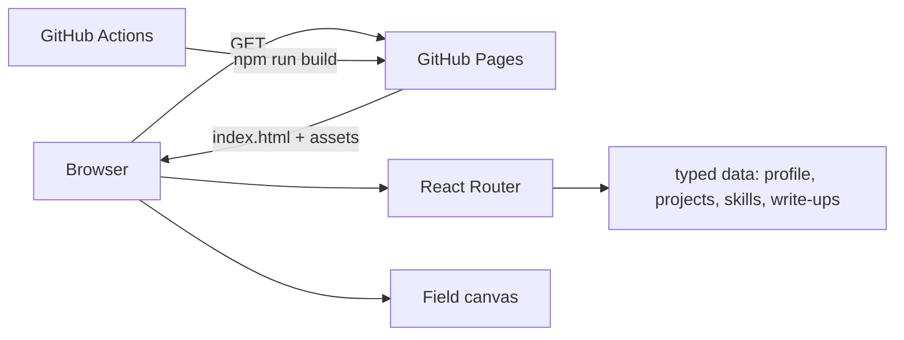

# PS Portfolio

Personal portfolio: one interactive experience that presents my backend projects as systems to inspect, plus my CV and coursework, for recruiters in software, fintech and quant roles.

**Live:** [code-by-panashe-sanyanga.github.io/PS-PORTFOLIO](https://code-by-panashe-sanyanga.github.io/PS-PORTFOLIO/) · **Stack:** React 19, TypeScript, Vite, React Router, Framer Motion, Canvas 2D. Deployed to GitHub Pages by GitHub Actions.

## Strongest work

If you're skimming this repo, these are the four worth actually opening:

- **[ApexIQ](https://code-by-panashe-sanyanga.github.io/PS-PORTFOLIO/work/apexiq)** ([GitHub](https://github.com/code-by-panashe-sanyanga/ApexIQ) · [live demo](https://apexiq-production-75e5.up.railway.app)): a Formula 1 pit wall in FastAPI and Next.js, with live timing, a GPS circuit trace, championship standings, and driver compare. No provider API keys.
- **[PremierIQ](https://code-by-panashe-sanyanga.github.io/PS-PORTFOLIO/work/premieriq)** ([GitHub](https://github.com/code-by-panashe-sanyanga/PremierIQ) · [live demo](https://premieriq-production.up.railway.app)): a Premier League dashboard in FastAPI and Next.js, with Poisson Monte Carlo Match IQ, a night stadium map, and Season IQ from remaining fixtures.
- **[NovaBank](https://code-by-panashe-sanyanga.github.io/PS-PORTFOLIO/work/novabank)** ([GitHub](https://github.com/code-by-panashe-sanyanga/NovaBank) · [live demo](https://novabank-api-production-2778.up.railway.app)): a double-entry banking API in FastAPI and PostgreSQL, with row-locked transfers, idempotency keys, and pytest covering the money path.
- **[ChatWire](https://code-by-panashe-sanyanga.github.io/PS-PORTFOLIO/work/chatwire)** ([GitHub](https://github.com/code-by-panashe-sanyanga/ChatWire) · [live demo](https://chat-wire-production.up.railway.app)): real-time messaging with auth, cursor pagination, and rate limits on the write paths.

This site is the hub that points at that work and explains it.

## What the site is

One environment, five pages, one visual system. A sparse network of nodes and data packets (Canvas 2D, one animation loop) sits behind every page and reacts to the pointer and to scroll; each page tunes its density. Pages emerge from that environment rather than swapping in.

| Route | What it is |
| --- | --- |
| `/` | Opening sequence (skippable, once per session), then selected work, about and contact. |
| `/work` | Project index. Each row is a system: number, name, one line, year, role; opening it reveals the description, stack, an illustrative system visual and the case study link. Coursework archive underneath. |
| `/work/:slug` | Case study: Overview · The problem · The system · Architecture (interactive graph) · Technology · Engineering decisions · Challenges · What I built · Result · Links. The original write-ups are rendered verbatim. |
| `/about` | Background journey, how I work, interests, skills map linking each technology to the projects where it was used, CV links. |
| `/contact` | Email, GitHub, LinkedIn, a mail action and the CV. No generic form. |

Old static URLs (`project-novabank.html`, `about.html`, …) redirect into the router. `cv.html` and the PDF are served as they were.

## How it works



- **Content is data.** `src/data/profile.ts`, `projects.ts` and `skills.ts` hold the real profile, project and skill information. `src/data/writeups.generated.ts` holds the eleven project write-ups extracted verbatim from the previous HTML pages, so nothing was rewritten or lost. Nothing on the site is invented: every job, qualification, technology and number comes from those files or the CV.
- **Motion respects the reader.** Framer Motion springs and reveals; every animation checks `prefers-reduced-motion`, the opening sequence is skipped entirely under it, the canvas renders one static frame, and nothing blocks reading or navigation.
- **Accessible by construction.** Semantic landmarks, one `h1` per route, keyboard-operable project rows, architecture nodes, pipelines and skill nodes (`aria-pressed` / `aria-expanded`), focus-visible styling, real alt text on screenshots, an Escape-closable menu.
- **Performance.** No 3D library: depth comes from parallax, layered UI and one 2D canvas that pauses when the tab is hidden. Route code is split per page; screenshots are lazy-loaded.

## Running it

Node 20+.

```bash
npm install
npm run dev        # http://localhost:5173
npm run build      # type-check + production build into dist/ (also writes 404.html for SPA routing)
npm run preview    # serve the production build
npm test           # Puppeteer smoke tests against dist/ (run build first)
```

The tests serve `dist/` the way GitHub Pages does (base path `/PS-PORTFOLIO/`, `404.html` fallback) and check: landmarks and a single `h1` on every route, alt text on project images, legacy redirects, the opening sequence and its Skip button, the reduced-motion path, keyboard expansion of the project index, contact links, and that the mobile menu opens/closes with no horizontal overflow.

## Deploying

`.github/workflows/pages.yml` builds on every push to `main` and deploys `dist/` with `actions/deploy-pages`. In the repository settings, **Pages → Build and deployment → Source** must be set to **GitHub Actions** (the previous site deployed straight from the branch).

## History

Version 1 (2025 – 2026) was plain HTML, CSS and vanilla JavaScript with a screenshot lightbox. The accessibility pass on that lightbox (focus trap, focus restore, arrow and Escape keys, autoplay disabled under reduced motion, Puppeteer keyboard walkthroughs) is documented in the [Portfolio case study](https://code-by-panashe-sanyanga.github.io/PS-PORTFOLIO/work/portfolio) and in the git history. Version 2 (this) rebuilt the experience around a shared visual and motion system while keeping every write-up.

## Limitations

No CMS or search; content changes are edits to the data files. Contact is a `mailto:` link rather than a form. I have not tested with a real screen reader; verification is automated (Puppeteer) plus reading the DOM state. The system visuals on project rows are illustrative diagrams of the data each system handles, not live or historical statistics.
