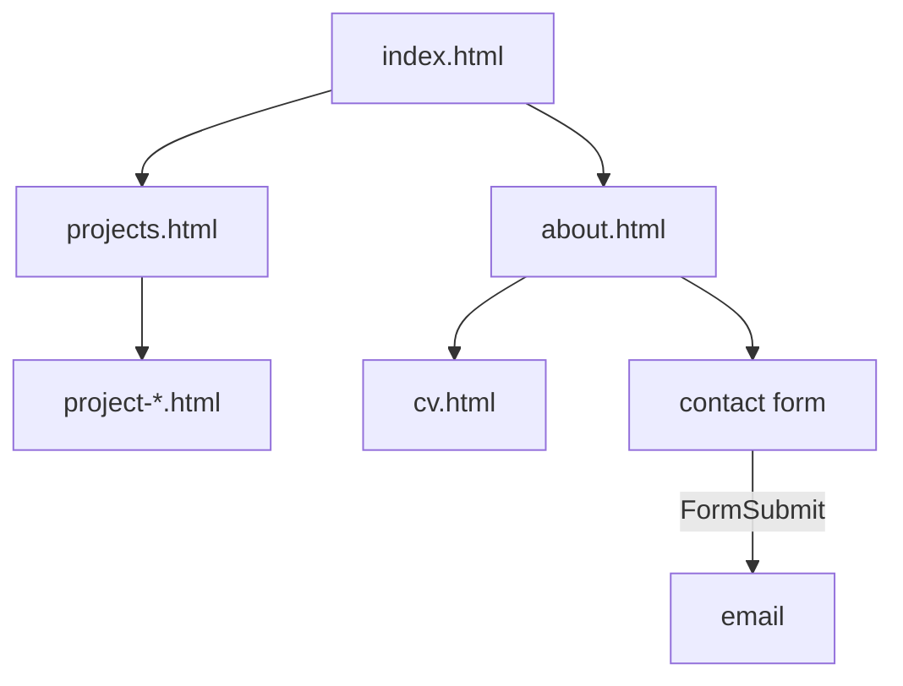

# PS Portfolio

Computer Science student at MMU, graduating 2027. Looking for graduate software engineering roles in London or Manchester.

This repo is the portfolio site itself: one link that collects my project write-ups, CV, and coursework instead of a CV attachment plus a pile of separate repos.


**Live:** [code-by-panashe-sanyanga.github.io/PS-PORTFOLIO](https://code-by-panashe-sanyanga.github.io/PS-PORTFOLIO/) · **Stack:** HTML, CSS, JavaScript, hosted on GitHub Pages

## Strongest work

If you're skimming this repo, these are the two worth actually opening:

- **[NovaBank](https://code-by-panashe-sanyanga.github.io/PS-PORTFOLIO/project-novabank.html)** ([GitHub](https://github.com/code-by-panashe-sanyanga/NovaBank) · [live demo](https://novabank-api-production-2778.up.railway.app)): a double-entry banking API in FastAPI and PostgreSQL, with row-locked transfers, idempotency keys, and pytest covering the money path.
- **[ChatWire](https://code-by-panashe-sanyanga.github.io/PS-PORTFOLIO/project-chatwire.html)** ([GitHub](https://github.com/code-by-panashe-sanyanga/ChatWire) · [live demo](https://chat-wire-production.up.railway.app)): real-time messaging with auth, cursor pagination, and rate limits on the write paths.

Each project's own README covers its reasoning in depth. This site is the one place that collects all of them with a consistent write-up and a link to the running thing.

## How it works

No database, no CMS, no build step. Every page's content is the HTML sitting in that file, and GitHub Pages serves those files as they are — nothing is rendered at request time because there's no request to render from. The only runtime state anywhere on the site is in script.js: which lightbox slide is showing and whether its autoplay timer is running, both plain JS variables that reset on every page load.



## Accessibility

I did a real pass on the one piece of custom interactive behaviour on the site — the screenshot gallery lightbox in script.js and its styles in styles.css — rather than listing it as future work.

**Focus trap. Didn't exist. Tab and Shift+Tab now cycle through the lightbox's own controls (close, prev, next, dots) and wrap, instead of escaping to the page underneath.

** restore. Didn't exist. Closing the lightbox (Escape, the close button, or a click outside the image) now returns focus to the thumbnail button that opened it, tracked per-open rather than assumed.

**ARIA on the dots. They were using role="tab" / aria-selected without the rest of the tabs pattern, which needs roving tabindex and matching tabpanels. The dots container is now role="group" and each dot uses aria-current, matching what they actually are: position indicators, not tabs. The overlay's aria-hidden is toggled explicitly on open/close alongside the hidden attribute.

**Prefers-reduced-motion. Autoplay had no check for it. It now reads window.matchMedia("(prefers-reduced-motion: reduce)") on load and via a change listener, so autoplay never starts and stops immediately if the OS setting changes mid-session. A matching CSS rule collapses animation and transition durations sitewide, which also covers the decorative background orbs.

Arrow key navigation, alt text on every , and header/nav/main/footer landmarks were already correct. I checked them and left them alone.

What I did not fix: Lighthouse's accessibility audit also flagged a color-contrast issue (`--accent-color` text on `--bg-light` backgrounds, e.g. the coursework `<summary>` links, falls just under the 4.5:1 ratio for normal text). That's a real finding but it's a site-wide colour decision, not part of the gallery audit, so I've left it alone rather than repainting the site as a side effect. I also haven't tested any of this with an actual screen reader, my verification was automated (a scripted keyboard walkthrough with Puppeteer) plus reading the resulting DOM state, which catches focus order and attribute correctness but not how something actually sounds read aloud.

## Decisions

**Plain HTML/CSS/JS over a static site generator.** 5 site pages plus 9 project write-ups don't need a build step, a framework, or npm to manage. The cost is repetition: there's no shared template for the header, nav, or footer, so a nav change means editing 14 files by hand.

**Chose not to add a CMS or database.** Content changes rarely enough that editing HTML directly beats standing anything up to manage it. Worth revisiting past roughly 20 pages.

**Got wrong: duplicating the project card markup instead of generating it.** The same <article class="project-card"> block is copied into both index.html and projects.html for every project. Fine at 9 projects, but it's already easy to let one copy drift. The fix is pulling card data into a single JSON or JS file and rendering both pages from it, and it's the thing that breaks first as the project list grows.

## Results

Lighthouse run properly (npx lighthouse against headless Chrome, 11 Aug 2026).

| Metric | Before | After |
| --- | --- | --- |
| Performance | 89 | 92 |
| Accessibility | 93 | 95 |
| Best Practices | 100 | 100 |
| SEO | 100 | 100 |

Between the two runs I compressed every project screenshot (anything over 1200px wide resized to 1200px, re-encoded as palette-quantized PNG with sharp), fixed the lightbox accessibility issues above, and wired the contact form to FormSubmit.

Total image payload across the 14 screenshots went from 4.92 MB to 1.28 MB — a 74% reduction with no visible quality loss, checked by eye at full size. Notably that only moved Performance 3 points, which says image weight wasn't the binding constraint on the score.

## The hard bit

The worst bug wasn't in the JavaScript, it was invisible characters. At some points editing HTML through PowerShell replaced ordinary apostrophes and dashes with characters that looked identical in the editor but rendered as mojibake once the page was actually opened in a browser or pushed to GitHub Pages. It didn't show up by reading the source, only by opening the affected pages and noticing broken punctuation where an apostrophe or dash should have been. The fix was going back through the content and normalising apostrophes and dashes to plain ASCII wherever it mattered.

## Testing

A small Puppeteer suite under tests/, running against a local static server:

bash
npm install
npm test

It checks page landmarks and image alts, walks the lightbox (focus trap, Escape restore, slide keys, reduced-motion autoplay off), and asserts the contact form posts to FormSubmit. Delivery itself depends on the one-time FormSubmit activation, so that part isn't covered.

Not covered on purpose: visual regression, a cross-browser Safari/Firefox matrix, and screen reader behaviour. Those stay manual, along with re-checking nav links and the live Pages URL after each deploy.

## Limitations

**Card markup duplication. Described under Decisions. First thing to fix, and the first thing that breaks at scale.
**No shared layout. Header, nav, and footer are edited in every HTML file. A tiny template step or a static site generator solves it once the page count justifies one.
**README screenshot drifts. It's a static image of a site I keep changing, so it needs re-shooting after any visible redesign.
**No analytics, so I don't know what visitors actually open. Worth adding something light.
**No search across write-ups. Only matters if the list outgrows what skimming the projects page can handle.
**Form-Submit needs one activation click on a fresh setup before delivery is live.

## Future improvements

- Generate project cards from one JSON or JS source so `index.html` and `projects.html` can't drift apart.
- Share header, nav, and footer instead of editing the same markup in every HTML file (a tiny template step or static site generator once the page count grows).
- Fix the accent-on-light contrast gap Lighthouse flagged, and verify the lightbox with a real screen reader rather than only Puppeteer keyboard walks.
- Drop the FormSubmit activation caveat once the live form has been confirmed end to end, and add light analytics so I know what recruiters actually open.
- Project search across write ups if the list grows past what skimming the projects page can handle.

## Running it

Prereqs: any modern browser. Python 3 only if you want a local server rather than opening files directly. Node 18+ for `npm test`.

```bash
git clone https://github.com/code-by-panashe-sanyanga/PS-PORTFOLIO.git
cd PS-PORTFOLIO
python -m http.server 5500
```

Then open http://localhost:5500/.

All links are relative and images are local, so opening index.html straight from disk works too — a server just matches how GitHub Pages actually serves it. Python 3 is only needed for that local server; Node 18+ only for npm test.
