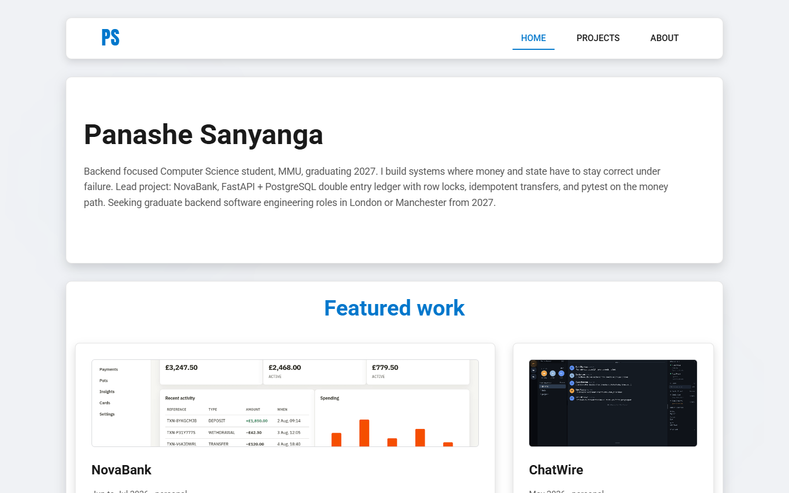
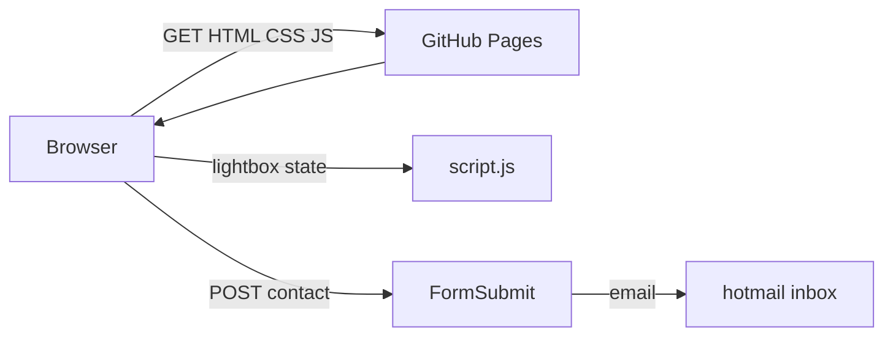
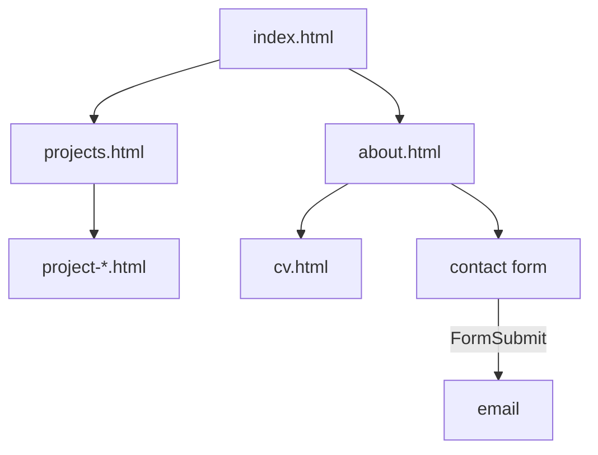

# PS Portfolio

Personal portfolio site where I show project write ups, my CV, and coursework to recruiters.



**Live:** [code-by-panashe-sanyanga.github.io/PS-PORTFOLIO](https://code-by-panashe-sanyanga.github.io/PS-PORTFOLIO/) · **Stack:** HTML, CSS, vanilla JavaScript, hosted on GitHub Pages

## Strongest work

If you're skimming this repo, these are the three worth actually opening:

- **[NovaBank](https://code-by-panashe-sanyanga.github.io/PS-PORTFOLIO/project-novabank.html)** ([GitHub](https://github.com/code-by-panashe-sanyanga/NovaBank) · [live demo](https://novabank-api-production-2778.up.railway.app)): a double-entry banking API in FastAPI and PostgreSQL, with row-locked transfers, idempotency keys, and pytest covering the money path.
- **[ChatWire](https://code-by-panashe-sanyanga.github.io/PS-PORTFOLIO/project-chatwire.html)** ([GitHub](https://github.com/code-by-panashe-sanyanga/ChatWire) · [live demo](https://chat-wire-production.up.railway.app)): real-time messaging with auth, cursor pagination, and rate limits on the write paths.
- **[What's For Dinner](https://code-by-panashe-sanyanga.github.io/PS-PORTFOLIO/project-whats-for-dinner.html)** ([GitHub](https://github.com/code-by-panashe-sanyanga/WHATS-FOR-DINNER)): a Year 2 group project, a recipe finder with a Python backend behind the matching logic. I did most of the delivery and team coordination on this one.

This site itself is just the hub that points at that work and explains it.

## Why

I needed one link to send recruiters instead of a CV attachment plus a pile of separate GitHub repos. A CV can't show a screenshot, explain a specific design decision, or link straight to a live demo, and a bare repo on its own doesn't explain any of that either. Each project's own README already covers its own reasoning in depth, NovaBank's included; this site is just the one place that collects all of them with a consistent write up and a link to the real thing.

## How it works



There's no database or CMS behind any of this: every page's content is just the HTML sitting in that file, and GitHub Pages serves the files as they are, nothing is rendered at request time because there's no request to render anything from. The only real runtime state anywhere on the site is in `script.js`, which tracks which lightbox slide is showing and whether its autoplay timer is running, both plain JS variables that reset every time a page loads or the lightbox opens.



| Path | Job |
|------|-----|
| `index.html` / `projects.html` | Hub and full project list |
| `project-*.html` | Per-project write ups + screenshot galleries |
| `about.html` | Bio, CV link, contact form |
| `cv.html` | Printable CV |
| `script.js` | Lightbox, contact submit, footer year |
| `styles.css` | Layout, gallery, reduced-motion |

## Accessibility

I did a real pass on the one piece of custom interactive behaviour on the site, the screenshot gallery lightbox in `script.js` and its styles in `styles.css`, rather than just listing this as future work.

What I checked and changed:

- **Focus trap.** Didn't exist before. Tab and Shift+Tab now cycle through the lightbox's own controls (close, prev, next, dots) and wrap around, instead of escaping to the page underneath. Verified with a scripted keyboard walk through a real page, not just by reading the code.
- **Focus restore.** Didn't exist before. Closing the lightbox (Escape, the close button, or clicking outside the image) now returns focus to the thumbnail button that opened it, tracked per-open rather than assumed.
- **Arrow key navigation.** This one already worked (Left/Right moved between slides). Left as is.
- **aria attributes on dots/controls.** The dots were using `role="tab"` / `aria-selected` without the rest of the ARIA tabs pattern (a real tab list needs roving tabindex and matching tabpanels, which this isn't). Changed the dots container to `role="group"` and each dot to `aria-current` instead, which matches what they actually are: a set of position indicators, not tabs. The overlay's `aria-hidden` is now also toggled explicitly on open/close alongside the `hidden` attribute.
- **Alt text.** Checked every `` on the site (project cards, project detail galleries, the lightbox). All of them already had specific, non-empty alt text describing what's actually in the screenshot. Nothing to fix here.
- **Semantic landmarks.** Checked header/nav/main/footer on every page. All of them were already there with one of each per page. Nothing to fix here either.
- **prefers-reduced-motion (JS).** Autoplay had no check for it. It now reads `window.matchMedia("(prefers-reduced-motion: reduce)")` on load and via a change listener, so autoplay never starts (and stops immediately if the OS setting changes mid-session).
- **prefers-reduced-motion (CSS).** Added a matching rule that collapses animation and transition durations sitewide, which also covers the decorative floating background orbs.

What I did not fix: Lighthouse's accessibility audit also flagged a color-contrast issue (`--accent-color` text on `--bg-light` backgrounds, e.g. the coursework `<summary>` links, falls just under the 4.5:1 ratio for normal text). That's a real finding but it's a site-wide colour decision, not part of the gallery audit, so I've left it alone rather than repainting the site as a side effect. I also haven't tested any of this with an actual screen reader, my verification was automated (a scripted keyboard walkthrough with Puppeteer) plus reading the resulting DOM state, which catches focus order and attribute correctness but not how something actually sounds read aloud.

## Decisions

**Plain HTML/CSS/JS over a static site generator.** A handful of site pages plus nine project write ups don't need a build step, a framework, or npm to manage. The cost is repetition beyond just project cards: there's no shared template for the header, nav, or footer either, so a nav change means editing it by hand in every one of the fourteen HTML files.

**Chose not to add a CMS or database.** Content changes rarely enough that editing HTML directly is faster than standing up anything to manage it. I'd revisit this if the project list grew past what I can keep straight by eye, maybe past 20 pages.

**Got wrong: duplicating the project card markup instead of generating it.** Copying the same `<article class="project-card">` block into `index.html` and `projects.html` for every project works fine at nine projects but it's already easy to let one copy drift out of date. I'd pull the card data into one JSON or JS file and render both pages from it if I touched this again.

## Results

I ran a real Lighthouse audit (`npx lighthouse` against headless Chrome, 11 Aug 2026) rather than guessing at numbers.

**Live before** (`https://code-by-panashe-sanyanga.github.io/PS-PORTFOLIO/`): Performance 89, Accessibility 93, Best Practices 100, SEO 100.

Then I compressed every project screenshot (resized anything over 1200px wide down to 1200px, re-encoded as palette-quantized PNG with `sharp`). Total image payload across the 14 screenshots went from 4.92 MB to 1.28 MB, a 74% reduction, with no visible quality loss on any of them (checked by eye, before/after, at full size). I also fixed the lightbox accessibility issues described above, and wired the contact form to FormSubmit so submissions arrive by email without needing a local mail client.

**Live after** (same URL, redeployed 11 Aug 2026): Performance 92, Accessibility 95, Best Practices 100, SEO 100.

## The hard bit

The worst bug wasn't in the JavaScript, it was invisible characters. At some points editing HTML through PowerShell replaced ordinary apostrophes and dashes with characters that looked identical in the editor but rendered as mojibake once the page was actually opened in a browser or pushed to GitHub Pages. It didn't show up by reading the source, only by opening the affected pages and noticing broken punctuation where an apostrophe or dash should have been. The fix was going back through the content and normalising apostrophes and dashes to plain ASCII wherever it mattered.

## Testing

There is a small automated suite under `tests/` (Puppeteer against a local static server):

```bash
npm install
npm test
```

What it covers:

- Home, projects, about, and a project detail page return 200 and expose landmarks (`header` / `nav` / `main` / `footer`).
- Every project card image has non-empty `alt`.
- Lightbox: open from a thumbnail, Tab stays trapped inside the dialog, Escape closes and restores focus to the thumbnail, Left/Right change slides.
- `prefers-reduced-motion: reduce` leaves autoplay off.
- Contact form posts to FormSubmit (network request asserted; delivery still needs the one-time FormSubmit activation email in hotmail).

What it deliberately does not cover: visual regression, cross-browser Safari/Firefox matrix, or a real screen reader. Those stay manual. I also re-check nav links and the live Pages URL after each deploy.

## Limitations

No CMS, so any content change means editing HTML directly. No search across projects. No analytics, so I don't actually know what recruiters look at or click on. Contact submissions go through FormSubmit to my hotmail inbox; the first submit from a new setup needs an activation click in that inbox before delivery is live. I haven't tested any of this with a real screen reader, and the known color-contrast gap on accent-colored text over the light background is unfixed. At several times the current number of projects, the thing that breaks first is the hand-copied card markup described under Decisions: keeping `index.html` and `projects.html` in sync by eye stops being realistic well before that point.

## Running it

Prereqs: any modern browser. Python 3 only if you want a local server rather than opening files directly. Node 18+ for `npm test`.

```bash
git clone https://github.com/code-by-panashe-sanyanga/PS-PORTFOLIO.git
cd PS-PORTFOLIO
python -m http.server 5500
```

Then open [http://localhost:5500/](http://localhost:5500/). All links are relative and images are local, so double-clicking `index.html` and browsing straight from disk works too, a server just matches how GitHub Pages actually serves it.
